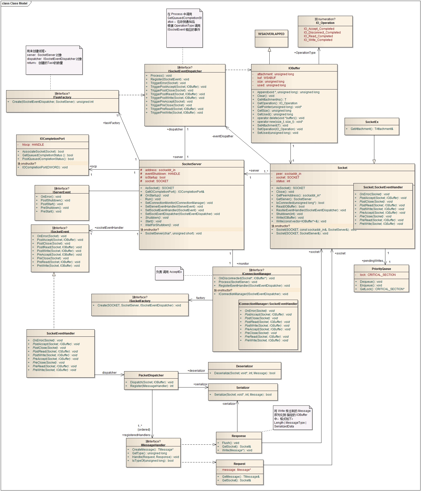

## demo ##
```c++
using namespace Framework;
using namespace log4cplus;
using namespace std;
using namespace TcpSocketServerSide;
using namespace Business;
using namespace Business::Handlers;

int _tmain(int argc, _TCHAR* argv[])
{
	Framework::WSAInitializor init;
	ITaskFactory* taskFactory = new DefaultTaskFactory(1);

	SocketServer* server = new TcpSocketServer(
		"192.168.1.103",
		8888,
		taskFactory
		);

	auto dispatcher = new TcpSocketEventDispatcher(*server);
	auto socketFactory = new TcpSocketFactory();
	auto manager = new TcpConnectionManager(*server, *dispatcher, *socketFactory);
	auto handler = new WhisperSocketEventHandler(*server);
	auto serverEventHandler = 
		new WhisperSocketEventHandler::ServerEventHandler(
		*server,
		*handler
		);

	/* register message handler */
	PacketDispatcher& packetDispatcher = handler->GetPacketDispatcher();
	packetDispatcher.Register(new AuthenticateRequestHandler());


	/* register message handler */

	server->SetSocketEventDispatcher(dispatcher);
	server->SetConnectionManager(manager);
	server->SetSocketEventHandler(handler);
	server->SetServerEventHandler(serverEventHandler);

	server->Start();

	/*Sleep(10*1000);*/
	//server->Shutdown();

	server->WaitForShutdown();
	
	/// ......
	return 0;
}
```


